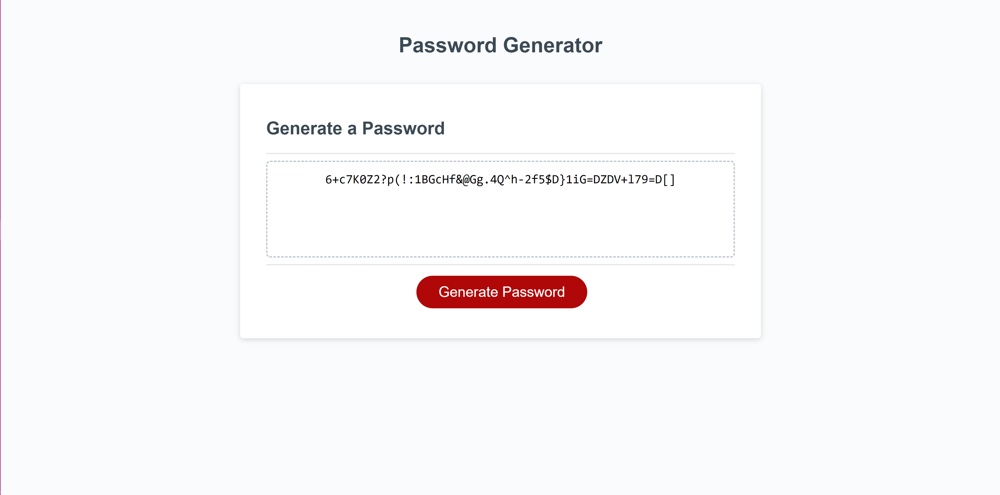

# Module 3 Challenge

## Password Generator

### Description

In this challenge, I created a strong password generator. That means that 
with each password, it will include lowercase & uppercase letters, 
numbers, & special characters & also be between 8 to 128 characters in 
length. Press "Generate Password" & give it a try! 

The original starter code was created by Xandromus (thanks again!) where 
they have done the HTML, CSS, & part of the JavaScript but left the 
password generation unfinished. You can check out their code at the 
link below.

https://github.com/coding-boot-camp/friendly-parakeet

### Screenshot

Here is a preview of the password generator!

As you can see, this is after a random password has been generated! 

### GitHub Repository 

You can view my coding process (however clumsy haha) at the link below.

https://github.com/kirbyfridge/module-3-challenge

### GitHub Pages

You can view the functional webpage at the link below.

https://kirbyfridge.github.io/module-3-challenge/

